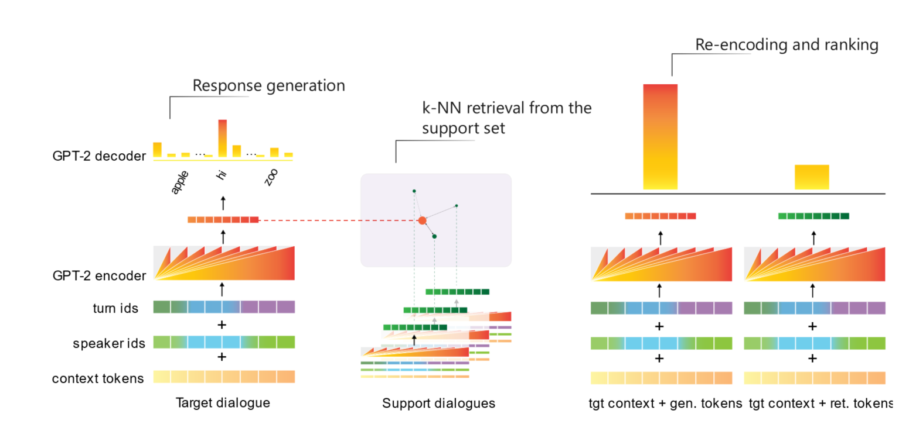

**GRTr**: **G**enerative-**R**etrieval **Tr**ansformers
==

Codebase for the papers:

[Hybrid Generative-Retrieval Transformers for Dialogue Domain Adaptation](https://arxiv.org/abs/2003.01680), DSTC8@AAAI 2020

[Fast Domain Adaptation for Goal-Oriented Dialogue Using a Hybrid Generative-Retrieval Transformer](https://ieeexplore.ieee.org/document/9053599), ICASSP 2020 [[virtual presentation](https://2020.ieeeicassp-virtual.org/presentation/poster/fast-domain-adaptation-goal-oriented-dialogue-using-hybrid-generative-retrieval)]

By [Igor Shalyminov](https://ishalyminov.github.io/), [Alessandro Sordoni](https://www.microsoft.com/en-us/research/people/alsordon/), [Adam Atkinson](https://www.microsoft.com/en-us/research/people/adatkins/), [Hannes Schulz](https://www.microsoft.com/en-us/research/people/haschulz/). 



Installation
------------

```bash
$ cd code-directory
$ conda create -n hybrid_retgen python=3.7
$ conda activate hybrid_retgen
$ conda install cython
$ pip install -e .
```

For mixed precision training:

```bash
$ pip install git+https://github.com/nvidia/apex
```

Datasets and experimental setup
--------

- [MetaLWOz](https://www.microsoft.com/en-us/research/project/metalwoz/) [[paper](https://www.microsoft.com/en-us/research/publication/multi-domain-task-completion-dialog-challenge/)]
- [baselines and task info](https://github.com/microsoft/dstc8-meta-dialog)

Training a base GPT-2 model on MetaLWOz
--------

```bash
$ python scripts/train <MetaLWOz zipfile> metalwoz_dataspec.json --dataset_cache cache exp/grtr --train_batch_size 4 --valid_batch_size 4 --early_stopping_after -1 --n_epochs 25
```

Add `--fp16 O1` to use mixed precision training.

Predictions
-----------

### generate-and-rank

```sh
python scripts/predict_generate_and_rank <MetaLWOz/MultiWoz zipfile> <testspec json> <output dir> <base GPT-2 model dir> --fine-tune --dataset_cache cache exp/grtr --train_batch_size 4 --valid_batch_size 4
```

### generate only

```sh
python scripts/predict <MetaLWOz/MultiWoz zipfile> <testspec json> <output dir> <base GPT-2 model dir> --fine-tune --dataset_cache cache exp/grtr --train_batch_size 4 --valid_batch_size 4
```

Convenience `bash` scripts are provided in `scripts/` to produce predictions for each of the three test specs.

Evaluation can be done using the [evaluate script](https://github.com/microsoft/dstc8-meta-dialog/blob/master/scripts/evaluate) in the competition baseline repository.

## Contributing

This project welcomes contributions and suggestions.  Most contributions require you to agree to a
Contributor License Agreement (CLA) declaring that you have the right to, and actually do, grant us
the rights to use your contribution. For details, visit https://cla.opensource.microsoft.com.

When you submit a pull request, a CLA bot will automatically determine whether you need to provide
a CLA and decorate the PR appropriately (e.g., status check, comment). Simply follow the instructions
provided by the bot. You will only need to do this once across all repos using our CLA.

This project has adopted the [Microsoft Open Source Code of Conduct](https://opensource.microsoft.com/codeofconduct/).
For more information see the [Code of Conduct FAQ](https://opensource.microsoft.com/codeofconduct/faq/) or
contact [opencode@microsoft.com](mailto:opencode@microsoft.com) with any additional questions or comments.
